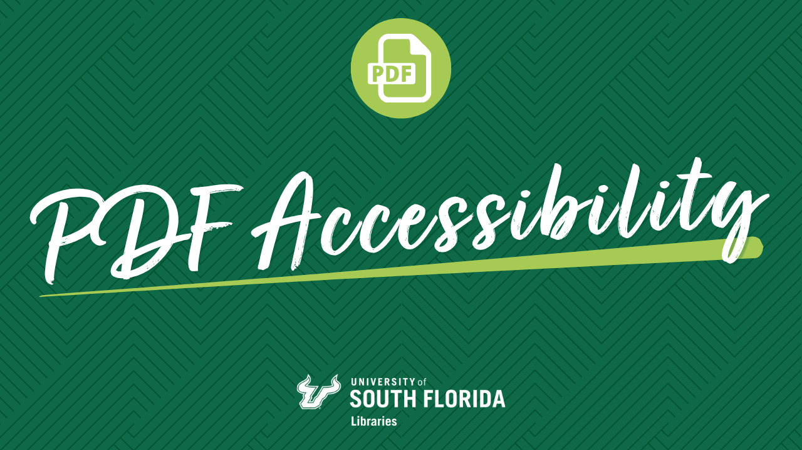
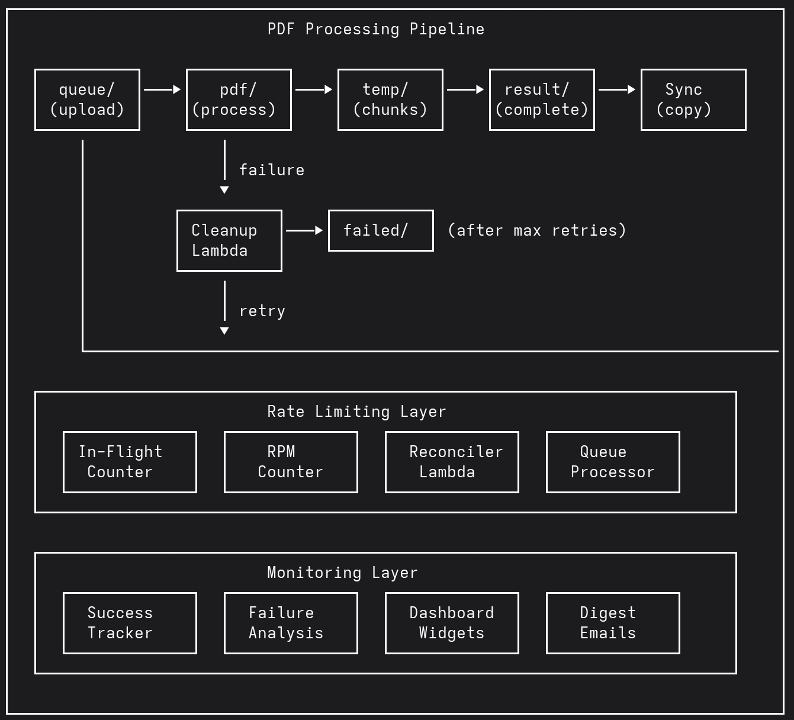

## About this implementation

This implementation was developed by the University of South Florida Libraries to support large‑scale PDF‑to‑PDF accessibility remediation workflows.

Primary development and integration were led by Richard R. Bernardy, Jr during the Spring 2026 semester, with initial consultation and architectural guidance received from AWS Solutions Architect Gabriel Brackman, while working closely with the USF Libraries Digital Initiatives (Special Collections) and Scholarly Communications (Integrated Research & Impact Services) teams.

---

The initial request for updates to the software was folder preservation throughout the processing cycle. Both teams are strongly collection oriented, they wanted to be able to drop a collection folder containing multiple pdfs into the incoming folder, and have that folder structure be preserved through each stage of processing across the pdf, temp, and result project S3 bucket folders.

With the original WCAG 2.1 Level II compliance deadline for public facing pdfs  of 2026-04-24,  we received access to the Adobe Developer console in order to create the required access key for the Adobe API in mid January 2026. The next several phases of improvements were to provide a throughput sufficient to process our pdfs with plenty of time left for the teams to get the updated content back into our Digtal Commons-based respository.

---

# PDF Accessibility Solution - Fork Improvements Summary

This document summarizes all the enhancements, features, and bug fixes implemented in this fork of the PDF Accessibility PDF-to-PDF Solution.

## Overview

This fork significantly extends the original PDF Accessibility PDF-to-PDF Solution with enterprise-grade features for high-volume PDF processing, including rate limiting, failure handling, monitoring dashboards, and automated retry mechanisms.

---

## 1. Folder Structure Preservation

### Problem Solved
The original solution lost folder organization when processing PDFs. Files uploaded to `pdf/batch1/subfolder/doc.pdf` would output to `result/COMPLIANT_doc.pdf`, making it difficult to organize large batches.

### Solution
- Full folder path is now extracted and preserved throughout the entire pipeline
- Input: `pdf/2024/january/report.pdf` → Output: `result/2024/january/COMPLIANT_report.pdf`
- Works with any folder depth
- Backward compatible with root-level files

### Files Modified
- `lambda/pdf-splitter-lambda/main.py` - Extract and pass folder path
- `lambda/pre-remediation-accessibility-checker/main.py` - Use folder path in reports
- `lambda/post-remediation-accessibility-checker/main.py` - Preserve folder in final reports
- `adobe-autotag-container/adobe_autotag_processor.py` - Handle folder paths in ECS
- `alt-text-generator-container/alt_text_generator.js` - JavaScript container folder support
- `lambda/pdf-merger-lambda/.../App.java` - Java merger preserves paths
- `cdk/cdk_stack.py` - Pass folder path through Step Functions

---

## 2. Enhanced PDF Splitting & Risk-Based Pre-Scanning

### Problem Solved
The original PDF splitter used `pypdf` with a basic risk scan that only detected large page dimensions, mixed page sizes, and rough image counts. It had no awareness of Adobe's 104MB file size limit per API call, so oversized chunks would be sent to Adobe and fail. There was also no way to configure the splitting page count without redeploying, and no mechanism to pre-fail PDFs that were almost certain to cause Adobe API errors.

### Solution: Size-Aware Splitting with Advanced Pre-Scan

#### Dual-Constraint Chunk Splitting
The `split_pdf_into_pages` function now enforces both page count AND file size limits:
- Chunks are created up to the configured page count
- Each chunk is checked against a 95MB size threshold (Adobe's hard limit is 104MB)
- If a chunk exceeds the size limit, the page count is halved and retried automatically
- Single pages that exceed the limit are uploaded with a warning (edge case for extremely large scanned pages)
- Uses PyMuPDF (`fitz`) instead of `pypdf` for faster and more reliable PDF manipulation

#### Advanced Pre-Scan with Weighted Risk Scoring
Replaced the simple `prescan_pdf_for_risk` function (binary risky/not-risky) with `prescan_pdf_advanced`, which produces a weighted complexity score:

| Risk Factor | Points |
|-------------|--------|
| File size > 100MB | +50 |
| File size > 50MB | +20 |
| Page count > 200 | +30 |
| Page count > 100 | +15 |
| MB/page > 5 (very high density) | +30 |
| MB/page > 2 (high density) | +15 |
| Images over 4MP | +20 |
| Images over 1MP (>5 images) | +10 |
| Pages larger than tabloid | +15 |
| Multiple page sizes (>3) | +10 |
| Image-heavy (>3 images/page) | +15 |
| CMYK images | +5 |
| Heavy vector graphics (>100 drawings/page) | +20 |
| JavaScript present | +10 |
| Embedded files | +5 |
| Encrypted PDF | +25 |
| Possibly scanned (<100 chars/page with images) | +15 |

Risk levels based on cumulative score:
- **LOW** (score < 25): Normal processing, 90 pages/chunk
- **MEDIUM** (score 25–49): Smaller chunks (1–5 pages depending on document size)
- **HIGH** (score ≥ 50): Moved to `pre-failed/` folder, not processed

#### Pre-Fail for High-Risk PDFs
PDFs scoring ≥ 50 are moved to a `pre-failed/` folder (preserving collection folder structure) with metadata recording the complexity score, risk level, and risk factors. This avoids wasting Adobe API calls on documents almost certain to fail.

#### Configurable Splitting via SSM Parameters
- `/pdf-processing/splitting-page-count` — Max pages per chunk when risk-based splitting is disabled (default: 95)
- `/pdf-processing/risk-based-splitting-enabled` — Toggle risk-based splitting on/off (default: true)
- When risk-based splitting is disabled, all PDFs use the SSM page count with size-limit enforcement only

#### DynamoDB Pre-Scan Data Storage
All pre-scan results are stored in the `pdf-prescan-data` DynamoDB table regardless of risk-based splitting setting, capturing page count, file size, risk score, image metrics, font counts, drawing counts, colorspace data, and recommended chunk size for later analysis.

### Files Modified
- `lambda/pdf-splitter-lambda/main.py` — Rewrote splitting logic and pre-scan; switched from `pypdf` to PyMuPDF

---

## 3. Adobe API Rate Limiting System

### Problem Solved
Adobe PDF Services API has a 200 requests/minute limit. Without rate limiting, concurrent ECS tasks would overwhelm the API causing 429 errors and failed processing.

### Solution: Dual-Protection Rate Limiter
1. **In-Flight Tracking**: Limits concurrent API requests (default: 150)
2. **RPM Limiting**: Limits requests per minute (default: 190)

### Key Components
- **DynamoDB Table**: `adobe-api-in-flight-tracker` stores counters
- **Rate Limiter Module**: `adobe-autotag-container/rate_limiter.py`
- **SSM Parameters**: Configurable limits without redeployment
  - `/pdf-processing/adobe-api-max-in-flight` (default: 150)
  - `/pdf-processing/adobe-api-rpm` (default: 190)

### Features
- Atomic counter operations with DynamoDB
- Exponential backoff when at capacity
- RPM window counters with auto-expiry (TTL)
- Real-time CloudWatch metrics

---

## 4. Queue-Based Processing System

### Problem Solved
Uploading thousands of PDFs at once would overwhelm AWS infrastructure (ECS throttling, subnet exhaustion, Step Function limits).

### Solution: Controlled Intake Queue
- Teams upload to `queue/` folder instead of `pdf/`
- Scheduled Lambda moves files to `pdf/` at controlled rate
- Prevents infrastructure overload while maintaining throughput

### Components
- **Queue Processor Lambda**: `lambda/pdf-retry-processor/main.py`
- Runs every 2 minutes via EventBridge
- Checks capacity before moving files
- FIFO ordering (oldest files first)

### Configuration (SSM Parameters)
- `/pdf-processing/queue-enabled` - ON/OFF switch
- `/pdf-processing/queue-max-in-flight` - Max in-flight before pausing (default: 10)
- `/pdf-processing/queue-max-executions` - Max Step Functions before pausing (default: 50)
- `/pdf-processing/queue-batch-size` - Files per batch (default: 5)

---

## 5. Automatic Retry System

### Problem Solved
Transient failures (rate limits, timeouts) would permanently fail PDFs, requiring manual re-upload.

### Solution: Automatic Retry with Backoff
- Failed PDFs move to `queue/` folder for automatic retry
- Retry count tracked in S3 object metadata
- After MAX_RETRIES (default: 3), PDFs move to `failed/` folder
- Original PDFs are NEVER deleted

### Flow
1. PDF fails processing → Cleanup Lambda detects failure
2. If retry_count < MAX_RETRIES → Move to `queue/` (increment count)
3. If retry_count >= MAX_RETRIES → Move to `failed/` folder
4. Queue processor picks up retries when capacity available

### Configuration
- `/pdf-processing/max-retries` - Retry attempts before giving up (default: 3)

---

## 6. In-Flight Counter Reconciliation

### Problem Solved
If an ECS task crashes without releasing its rate limit slot, the counter gets "stuck", blocking all new processing.

### Solution: Automatic Reconciler
- Scheduled Lambda runs every 5 minutes
- Compares counter against actual running tasks
- Resets counter if clearly stale
- Cleans up orphaned file tracking entries

### Components
- **Reconciler Lambda**: `lambda/in-flight-reconciler/main.py`
- **ECS Task Failure Tracker**: `lambda/ecs-task-failure-tracker/main.py`
  - Triggered by EventBridge on ECS task failures
  - Updates tracking entries with crash details
  - Decrements counter for crashed tasks

### Configuration
- `/pdf-processing/reconciler-enabled` - Enable/disable (default: true)
- `/pdf-processing/reconciler-max-drift` - Max counter drift before reset (default: 5)

---

## 7. PDF Failure Analysis

### Problem Solved
When PDFs fail Adobe API processing, there was no insight into why they failed.

### Solution: Automated PDF Analysis
- Lambda analyzes failed PDFs using PyMuPDF
- Identifies likely failure causes (large images, too many pages, encryption, etc.)
- Generates detailed reports

### Analysis Checks
- Page count (>500 pages flagged)
- File size (>100 MB flagged)
- Image count and dimensions (>4000px flagged)
- Font count and embedding status
- Encryption detection
- PDF version compatibility
- Annotation count

### Output
- Structured CloudWatch logs
- Word document reports saved to S3
- Integration with failure digest emails

### Files
- `lambda/pdf-failure-analysis/main.py`
- `lambda/pdf-failure-analysis/analyzer.py`

---

## 8. Success Tracking & Throughput Metrics

### Problem Solved
No visibility into processing throughput or progress toward remediation goals.

### Solution: Comprehensive Success Tracking
- **Success Tracker Lambda**: Records completions in DynamoDB
- **Success Rate Widget**: CloudWatch dashboard widget

### Metrics Tracked
- Total PDFs processed (all time)
- PDFs processed today
- Hourly averages (24-hour rolling)
- Current hour count
- Queue depth
- Failed file count

### Dashboard Features
- Remediation goal progress
- Estimated days to completion
- Days to deadline countdown
- Real-time queue status

### Files
- `lambda/pdf-success-tracker/main.py`
- `lambda/success-rate-widget/main.py`

---

## 9. CloudWatch Dashboard Widgets

### Custom Widgets Added
1. **Success Rate Widget** - Throughput metrics and goal tracking
2. **Rate Limit Widget** - Current in-flight and RPM utilization
3. **In-Flight Files Widget** - Files currently being processed
4. **Failure Analysis Widget** - Recent failure summaries

### Files
- `lambda/rate-limit-widget/main.py`
- `lambda/in-flight-files-widget/main.py`
- `lambda/success-rate-widget/main.py`

---

## 10. Failure Digest Emails

### Feature
Daily email digest of PDF processing failures sent to relevant team members.

### Components
- **Failure Digest Lambda**: `lambda/pdf-failure-digest/main.py`
- Runs daily at 11:55 PM via EventBridge
- Groups failures by user/collection
- Includes failure reasons and analysis summaries

---

## 11. S3 PDF Copier (Auto-Sync)

### Feature
Automatically copies successfully processed PDFs to a destination bucket.

### Use Case
  Sync remediated PDFs to a separate bucket for distribution or archival (controlled public access, for getting items back into our Digital Commons-based site for Digital and Scholarly communications collections..

### Components
- `lambda/s3-pdf-copier/main.py`
- Triggered by S3 events on `/result` prefix
- Preserves folder structure in destination

---

## 12. Pipeline Status Checker

### Feature
Lambda that checks the overall health of the processing pipeline.

### Checks Performed
- Step Function execution status
- ECS task health
- Queue depths
- Rate limiter status

### Files
- `lambda/pipeline-status-checker/main.py`

---

## 13. Failure Report Generation

### Feature
Generate Excel reports of PDF failures filtered by collection, date range, error type.

### Components
- `lambda/failure-analysis-report/main.py`
- Queries DynamoDB failure records
- Generates downloadable Excel files

### Planned Enhancement
- Web UI for on-demand report generation (spec in `.kiro/specs/failure-report-web-ui/`)

---

## 14. Bug Fixes

### Step Functions Data Flow
- Fixed `result_path` on ECS tasks to preserve input data
- Fixed environment variable passing between tasks
- Fixed Java Lambda output wrapping for Step Functions compatibility

### JavaScript Container Scoping
- Fixed variable scoping in `alt-text.js` where `fileDirectory` and `fileKey` were undefined in `modifyPDF` function

### Folder Path Extraction
- Fixed `add_title` Lambda to preserve full folder path (was removing too many components)
- Fixed `a11y_postcheck` Lambda to extract and use folder path from save_path

---

## 15. Helper Scripts

### SSM Parameter Management
| Script | Purpose |
|--------|---------|
| `bin/set-all-ssm-parameters.sh` | Set all SSM parameters at once |
| `bin/view-current-ssm-parameters.sh` | View all current SSM parameter values |
| `bin/set-adobe-max-in-flight.sh` | Set Adobe API max in-flight limit |
| `bin/set-adobe-rpm.sh` | Set Adobe API RPM limit |
| `bin/set-max-retries.sh` | Configure max retry count |
| `bin/set-queue-batch-size.sh` | Set queue batch size |
| `bin/set-queue-batch-size-low-load.sh` | Set queue batch size for low-load periods |
| `bin/set-queue-max-executions.sh` | Set max Step Function executions |
| `bin/set-queue-processor-parameters.sh` | Set all queue processor parameters |
| `bin/set-reconciler-enabled.sh` | Enable/disable reconciler |
| `bin/set-reconciler-max-drift.sh` | Set reconciler max drift |
| `bin/set-remediation-deadline.sh` | Set remediation deadline date |
| `bin/set-remediation-goal.sh` | Set remediation goal count |
| `bin/set-risk-based-splitting.sh` | Toggle risk-based splitting on/off |
| `bin/set-splitting-page-count.sh` | Set splitting page count |
| `bin/set-sender-email.sh` | Configure notification sender email |
| `bin/set-fork-version.sh` | Set fork version parameter |
| `bin/set-starting-value-ppt-tpat.sh` | Set starting value for throughput tracking |

### Queue Management
| Script | Purpose |
|--------|---------|
| `bin/queue-pause.sh` | Pause queue processing |
| `bin/queue-resume.sh` | Resume queue processing |
| `bin/check-queue-status-live.sh` | Check queue status (live environment) |
| `bin/check-queue-status-test.sh` | Check queue status (test environment) |

### In-Flight & Rate Limit Diagnostics
| Script | Purpose |
|--------|---------|
| `bin/check-in-flight-status.sh` | Diagnose in-flight counter issues |
| `bin/reset-AIFRRT-in-flight-value-to-zero.sh` | Manual counter reset |
| `bin/reset-in-flight-counter.sh` | Reset in-flight counter |
| `bin/clear-stuck-counter.sh` | Clear a stuck counter |
| `bin/clear-rate-limit-table.sh` | Clear rate limit tracking table |
| `bin/cleanup-stale-in-flight-files.sh` | Clean up stale in-flight file entries |
| `bin/cleanup-in-flight_remove_from_dynamodb_table.py` | Remove specific entries from in-flight DynamoDB table |
| `bin/cleanup-ecs-tasks.py` | Clean up orphaned ECS tasks |

### Failure Analysis & Reporting
| Script | Purpose |
|--------|---------|
| `bin/diagnose-failures.py` | Diagnose PDF processing failures |
| `bin/trigger-failure-analysis-report.sh` | Trigger failure analysis report generation |
| `bin/generate-trigger-failure-analysis-report.sh` | Generate and trigger failure analysis report |
| `bin/get-all-failure-records-from-the-pdf-failure-records-dynamodb-table.sh` | Export all failure records from DynamoDB |
| `bin/get-file-listing-failed.sh` | List failed files |
| `bin/get-file-listing-failed-summary.sh` | Summarized listing of failed files |

### S3 File Counts & Listings
| Script | Purpose |
|--------|---------|
| `bin/get-file-count-failed.sh` | Count files in failed/ folder |
| `bin/get-file-count-queue.sh` | Count files in queue/ folder |
| `bin/get-file-count-result.sh` | Count files in result/ folder |
| `bin/list-folder-content.sh` | List contents of an S3 folder |
| `bin/s3-listing-to-xlsx.py` | Export S3 listing to Excel |

### ECS & Step Functions
| Script | Purpose |
|--------|---------|
| `bin/ecs-list-tasks.sh` | List running ECS tasks |
| `bin/ecs-describe-tasks.sh` | Describe ECS task details |
| `bin/check-step-function-executions.sh` | Check Step Function execution status |
| `bin/list-running-executions-statemachine.sh` | List running state machine executions |
| `bin/stop-running-executions-statemachine.sh` | Stop running state machine executions |

### PDF Testing & Analysis
| Script | Purpose |
|--------|---------|
| `bin/prescan-pdf.py` | Run basic pre-scan on a local PDF |
| `bin/prescan-pdf-advanced.py` | Run advanced pre-scan on a local PDF |
| `bin/split-pdf.py` | Split a PDF locally for testing |
| `bin/invoke-pdf-splitter.py` | Invoke the splitter Lambda directly |

### Monitoring, Notifications & Misc
| Script | Purpose |
|--------|---------|
| `bin/check-api-duration.sh` | Check Adobe API call durations |
| `bin/check-bedrock-current-quotas.sh` | Check Bedrock service quotas |
| `bin/check-logs.sh` | Check CloudWatch logs |
| `bin/scan-cww-adobe.sh` | Scan CloudWatch for Adobe metrics |
| `bin/performance-monitor.py` | Monitor pipeline performance |
| `bin/manage-digest.py` | Manage failure digest settings |
| `bin/manage-notifications.py` | Manage notification settings |
| `bin/trigger-pdf-report.sh` | Trigger PDF report generation |
| `bin/verify-aws-profile.sh` | Verify AWS CLI profile is configured |

### DynamoDB Utilities
| Script | Purpose |
|--------|---------|
| `bin/export-dynamodb-to-excel.py` | Export DynamoDB table to Excel |
| `bin/list-dynamodb-tables.sh` | List all DynamoDB tables |
| `bin/list-some-dynamodb-table-rows.sh` | Sample rows from a DynamoDB table |
| `bin/view-success_total-in-dynamodb-table.sh` | View success totals in DynamoDB |

### Lambda Configuration Updates
| Script | Purpose |
|--------|---------|
| `bin/update-lambda-function-configuration-far.sh` | Update failure analysis report Lambda config |
| `bin/update-lambda-function-configuration-success-rate-widget.sh` | Update success rate widget Lambda config |
| `bin/create-CloudWatch-Dashboard-Widgets-invocation-permission-policy.sh` | Create IAM policy for dashboard widgets |

---

## 16. Documentation

### New Documentation Files
- `docs/ADOBE_API_RATE_LIMITING.md` - Rate limiting implementation details
- `docs/ADOBE_API_QUEUE_ARCHITECTURE.md` - Queue architecture design
- `docs/PDF_DELETION_CLEANUP_FEATURE.md` - Failure cleanup and retry system
- `docs/PDF_FAILURE_ANALYSIS_FEATURE.md` - Failure analysis feature
- `docs/IN_FLIGHT_COUNTER_MONITORING.md` - Counter monitoring and recovery
- `docs/FIX_APPLIED_SUMMARY.md` - Detailed changelog of all fixes
- `docs/DEPLOYMENT_GUIDE.md` - CDK deployment instructions
- `docs/MANUAL_DEPLOYMENT.md` - Manual deployment steps
- `docs/TROUBLESHOOTING_CDK_DEPLOY.md` - CDK deployment troubleshooting
- `docs/IAM_PERMISSIONS.md` - Required IAM permissions
- `docs/FORK_IMPROVEMENTS_SUMMARY.md` - Summary of fork improvements
- `docs/PROMPT-AUTOMATIC-SYNCING-UPDATED.md` - Prompt and automatic syncing documentation
- `docs/USF-Libraries-PDF-to-PDF-remediation.md` - This document (comprehensive fork overview)

### Reference Files
- `docs/change-sender-email.sh` - Script for changing SES sender email
- `docs/gabriels-kiro-prompt.txt` - Reference prompt from AWS Solutions Architect
- `docs/summary-of-changes-20260225-1119.txt` - Change summary from Feb 25, 2026

### Images
- `docs/images/architecture.png` - Architecture diagram

---

## Architecture Diagram

---

## Summary Statistics

| Category | Count |
|----------|-------|
| New Lambda Functions | 12 |
| Modified Lambda Functions | 6 |
| New Documentation Files | 13 |
| Helper Scripts | 65+ |
| SSM Parameters | 17+ |
| CloudWatch Widgets | 4 |

---

## Version history
|2026-05-05 | Initial version |

